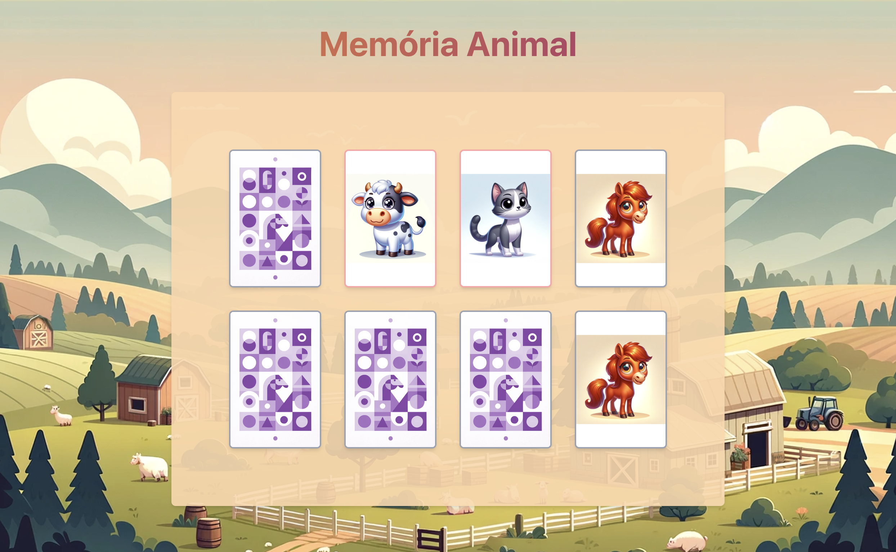

# Jogo da Memória Animal

Este é um simples jogo da memória construído com React e TypeScript. O jogo apresenta um conjunto de cartas com diferentes imagens de animais. O objetivo do jogo é encontrar todos os pares de cartas correspondentes.

## Como Jogar

1. Clique em uma carta para revelar o animal.
2. Clique em outra carta para encontrar o animal correspondente.
3. Se os animais combinarem, as cartas permanecerão viradas. Se não combinarem, elas voltarão após um curto intervalo.
4. O jogo termina quando todos os pares de cartas foram encontrados.

## Instalação

1. Clone este repositório
2. Instale as dependências: `npm install`
3. Inicie o jogo: `npm start`

## Recursos

- Cartas com diferentes imagens de animais
- As cartas viram quando clicadas
- Pares de cartas correspondentes permanecem viradas
- Cartas não correspondentes voltam após um curto intervalo
- Jogo termina quando todos os pares foram encontrados

## Melhorias Futuras

- Adicionar um cronômetro para acompanhar quanto tempo leva para encontrar todos os pares
- Adicionar uma pontuação baseada no número de tentativas
